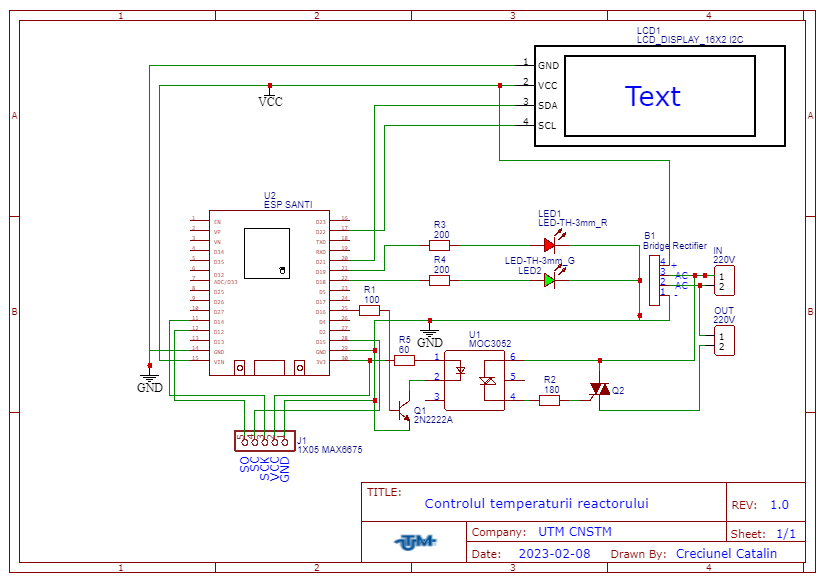
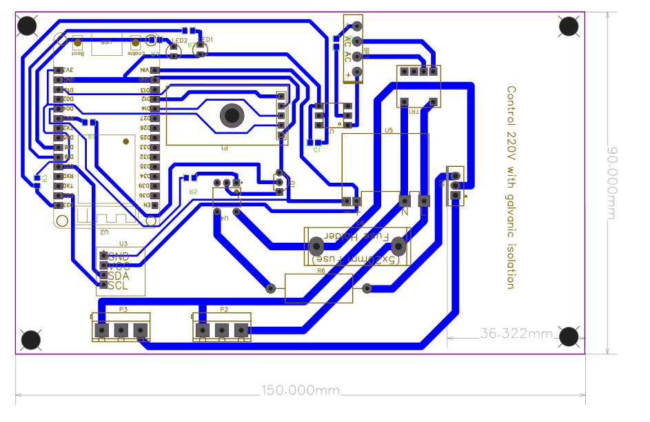

# Temocontroler-on-ESP32-using-MAX6675

    This device is made for control a load conenected to 220V 
 
    Device can read and set power also have app for using via USB from PC or Bluetooth and another program for web interface
    Circuit is created luking at case form and size 
 
