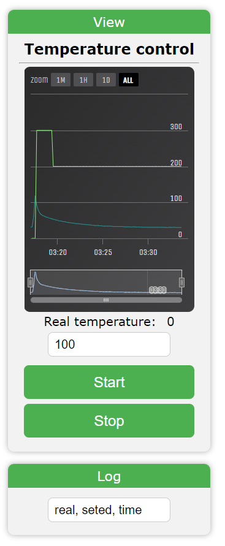

<h1>Temocontroler on ESP32 using MAX6675</h1>

This project is designed to measure temperature in both a room and a thermal reactor, and to set the temperature by controlling the current through a PID-controlled triac, which is directed through galvanic isolation by an MOC3052.

The device is capable of controlling a load connected to 220V.

It includes a web interface that can be accessed on the local Wi-Fi network, hosted on an ESP32 microcontroller.

Actual cod is in folder v.0.1 <a href="V.0.1/MCUCod/MCUCod.ino"> MCUCod </a>

The circuit and PCB design can be found on EasyEDA:

<a href="https://oshwlab.com/creciunelcatalin/controlul-temperaturii">EasyEDA - Circuit and PCB</a>

This project also features an application for use via USB from a PC or Bluetooth, providing versatile control options.

The circuit design takes into account the form and size of the case for practical implementation.

